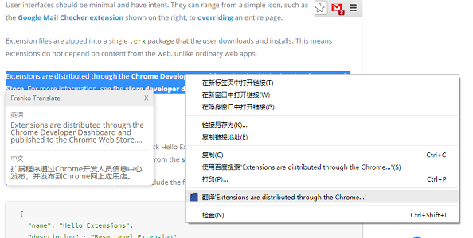

**Franko Translate - 开启你的划词翻译之旅吧！**

## Franko Translate
### 一、项目介绍
此项目是一款的划词翻译插件，需要安装在 Chrome 浏览器上。安装此插件后，用户使用鼠标高亮页面中的文字，就可以将对应内容翻译为指定语言了。借助这款插件，在我们浏览网页时就可以很方便地翻译一些需要的内容。

以前从来没有试着去开发过一个 Chrome 浏览器的拓展程序，因此这也算是我的插件开发初学项目。虽然内容简单，但也基本覆盖到了插件开发的一些重要内容，而且就功能上来说目前并没有出现什么问题。使用到的技术包括：

* Chrome Extensions、ES6、HTML(5)、CSS(3)

由于这款插件并没有发布到 Chrome 应用商店上，所以并不能直接安装。因此如果想要体验这款插件，就要经历这几个步骤：

1. 打开导航栏中「自定义及控制」按钮，找到如图所示的「拓展程序」模块：<div align=center></div>
2. 进入「拓展程序」后，开启开发者模式：<div align=center></div>
3. 开启开发者模式后，导航栏下方就会显示「加载已解压的拓展程序」。这时先下载我们这款划词翻译插件的压缩包<a href="https://github.com/FanKaiqiang/Translate-extension/raw/master/Extensions.zip" download="划词翻译插件">（点我下载）</a>，然后解压。<div align=center></div>
4. 解压插件压缩包后，点开「加载已解压的拓展程序」，找到刚才解压的文件夹，点击「选择文件夹」：<div align=center></div>
5. 然后我们就可以在拓展程序列表中看到我们的插件，开启你的划词翻译之旅吧！<div align=center></div>

## 二、使用划词翻译插件
在使用这款划词翻译前，需要在插件导航栏处打开翻译开关。如果需要暂停使用划词翻译的功能，也可以在这里将开关关闭：<div align=center></div>

然后我们就可以通过使用鼠标高亮页面中的文字，将对应内容进行翻译了。翻译的内容会以一个浮层的形式出现在页面上，如图所示，因为浮层的大小有限，通过这种方法只能可以帮助我们翻译一段并不太长的文字：<div align=center></div>

如果要翻译很长的一段话，这时可以通过鼠标右击高亮区域，召出菜单选项，点击「翻译」选项就可以进入谷歌翻译的对应页面进行翻译了：<div align=center></div><div align=center></div>

除此之外，划词翻译插件还支持多种语言的翻译。可以在设置中设置语言，然后就可以对应的翻译效果了：<div align=center></div><div align=center></div>

## 三、总结
虽然这个插件功能和内容都很简单，而且在技术上也没有什么炫酷的操作，这里主要需要注意的是整个 Chrome 插件项目的文件结构与配置，以及每个文件在这个插件中起到了什么样的作用。我们来分析一下 `manifest.json`，这是整个插件项目的配置文件：
``` json
{
  "name": "Franko Translate",                 //  插件名
  "version": "1.0",                           //  版本号
  "description": "开启你的划词翻译之旅吧！",    //  介绍
  "manifest_version": 2,                      //  配置的版本
  "permissions": [                            //  依赖
    "activeTab",
    "storage",
    "contextMenus",
    "tabs"
  ],
  "background": {                             //  插件后台代码
    "scripts": ["background.js"],
    "persistent": false
  }, 
  "content_scripts": [                        //  插件内容与样式
    {
      "matches": [
        "<all_urls>"                          //  所以地址下均显示插件内容
      ],
      "css": [
        "contentScript.css"
      ],
      "js": [
        "contentScript.js"
      ]
    }
  ],
  "browser_action": {                         //  浏览器行为
    "default_title": "Franko Translate",      //  导航栏的标题
    "default_popup": "popup.html"             //  导航栏浮层代码
  },
  "options_page": "options.html",             //  设置页代码，这次的项目中没有用到
  "icons": {                                  //  各种大小下的 icon 文件
    "16": "images/get_started16.png",
    "32": "images/get_started32.png",
    "48": "images/get_started48.png",
    "128": "images/get_started128.png"
  }
}
```
上面就是这个项目所有的文件配置的相关内容。除此之外，几种 window.chrome 的 API 的使用也很重要。比如 `chrome.runtime.onMessage.addListener` 可以用以监听插件向页面发送消息，`chrome.storage.sync.get` 与 `chrome.storage.sync.set` 分别用于从 storage 中获取与设置值。要想做好一个 Chrome 插件，弄清楚这些是必不可少的，关键时候还是得去查文档，插件开发文档地址：[https://developer.chrome.com/extensions](https://developer.chrome.com/extensions)。